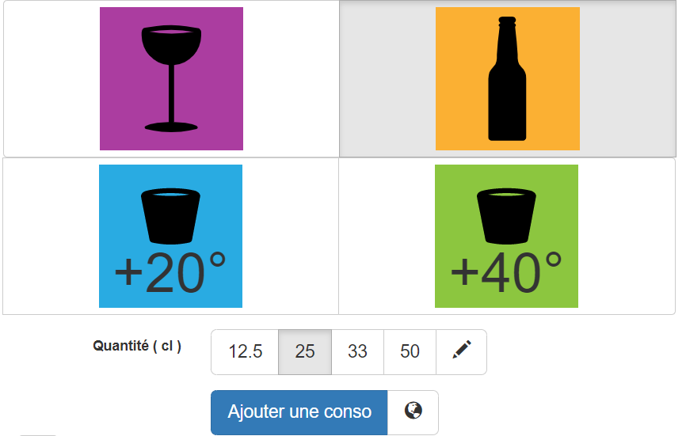
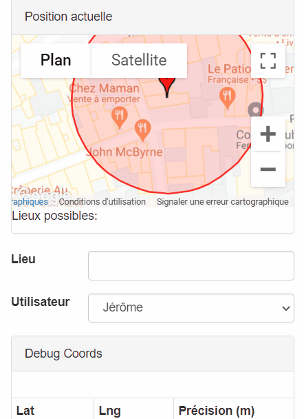
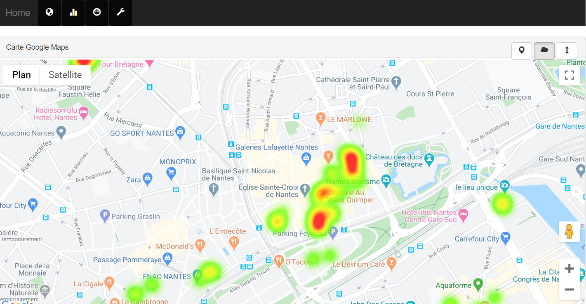
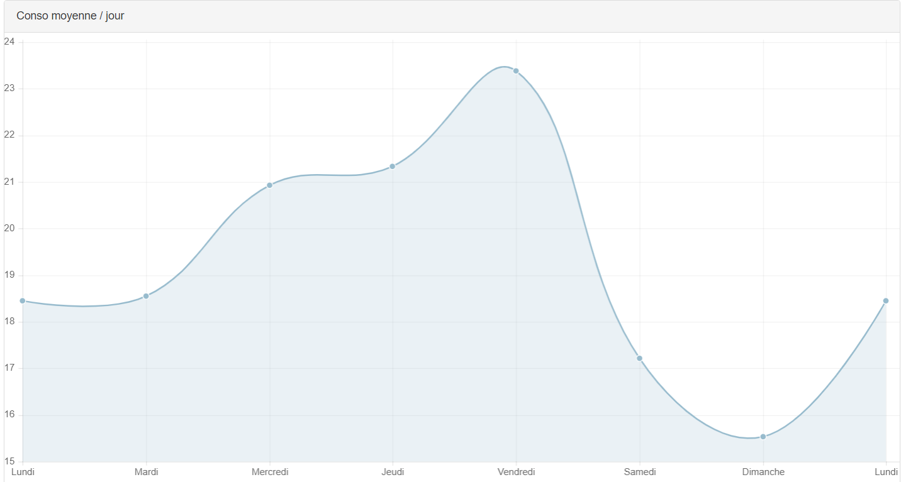

# Drink DATA

Drink DATA is a toy project to play with HTML Geolocation API and Google Maps APIs.

Its purpose is to gather alcohol quantity and places to display them on a heatmap.

## Requirements

* Unix-like operating systems
* Apache
* PHP5
* SQLite

## Features

### HTML Geolocation

### Google Maps Places and Visualization APIs

### Chart.js

